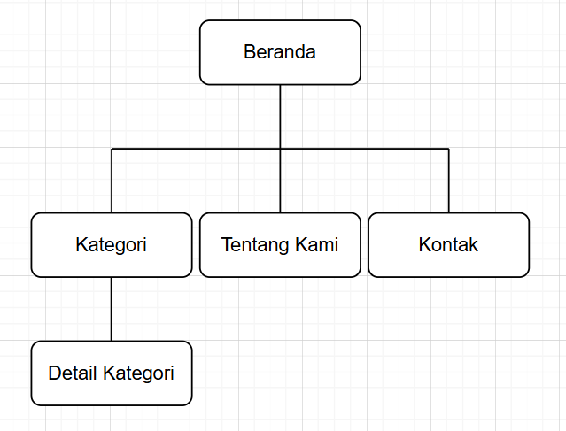
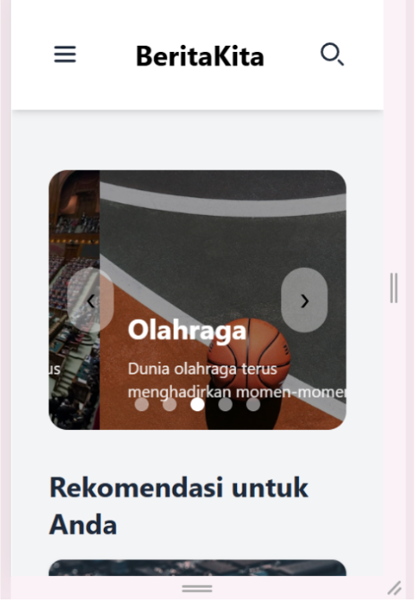
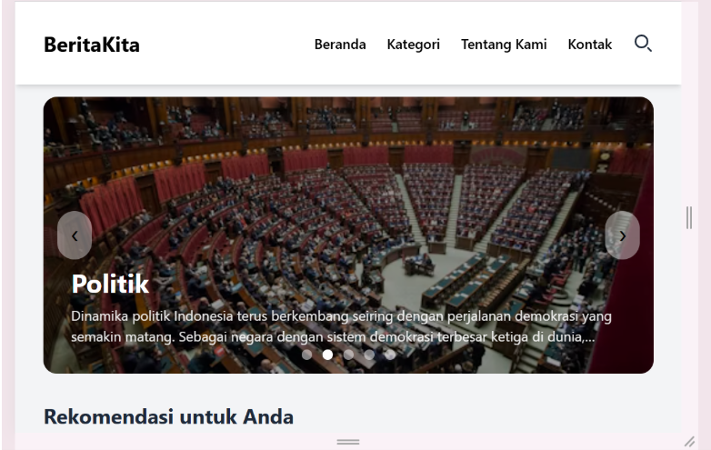
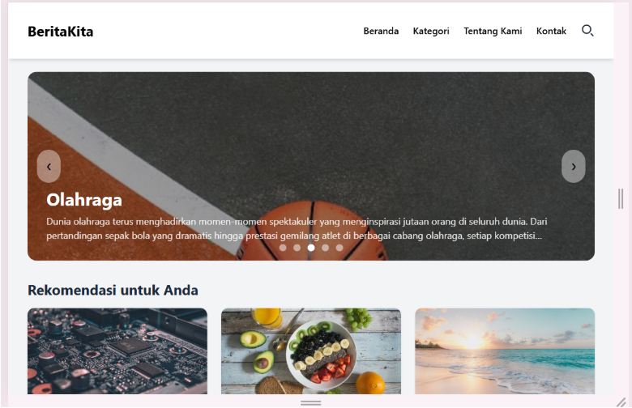
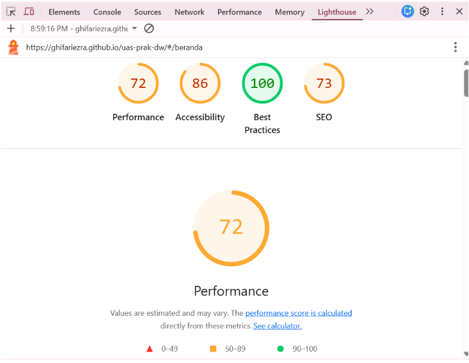

# 📌 BeritaKita

## 📰 Deskripsi Proyek

BeritaKita adalah sebuah portal berita online yang dirancang untuk menyajikan informasi terkini, akurat, dan terpercaya kepada pembaca. Website ini bertujuan menjadi sumber informasi yang mudah diakses oleh berbagai kalangan dengan tampilan yang sederhana, bersih, dan responsif.

Situs BeritaKita dilengkapi dengan menu navigasi yang jelas seperti Beranda, Kategori, Tentang Kami, dan Kontak, sehingga memudahkan pengguna dalam menjelajahi konten. Selain itu, tersedia fitur pencarian berita yang membantu pembaca menemukan informasi yang dibutuhkan dengan cepat dan efisien.

BeritaKita menyajikan berbagai topik berita, mulai dari politik, olahraga, teknologi, hiburan, hingga topik menarik lainnya yang relevan dengan kehidupan sehari-hari. Untuk memperluas jangkauan informasi dan interaksi dengan pembaca, situs ini juga mencantumkan tautan ke akun media sosial BeritaKita Official sebagai sarana berbagi berita dan komunikasi.

## 👥 Daftar Anggota Kelompok

1. Az-Zahra Putri – 4524210018
2. Dheka Airlangga – 4524210027
3. Fatimah – 4524210052
4. Maghfiroh Lisabiliana – 4524210040
5. Ghifari Ezra Ramadhan – 4524210041
6. Jihan Hanifah – 4524210047

## 🛠 Framework yang Digunakan

Website BeritaKita dibuat menggunakan Tailwind CSS sebagai framework utama. Alasan penggunaan Tailwind CSS:
* Memudahkan pengaturan tata letak dan desain antarmuka
* Menjaga tampilan website tetap rapi dan konsisten
* Mendukung desain responsif untuk berbagai ukuran layar (mobile, tablet, dan desktop)

## ✨ Fitur-Fitur Website

### 1. Halaman Beranda
Menampilkan banner atau slider berita utama, rekomendasi berita, serta daftar berita terbaru dari berbagai kategori. Halaman ini berfungsi sebagai pusat informasi awal bagi pengguna.

### 2. Navigasi Menu Utama
Menu navigasi di bagian atas halaman memudahkan pengguna berpindah antar halaman seperti Beranda, Kategori, Tentang Kami, dan Kontak secara cepat dan terstruktur.

### 3. Kategori Berita
Fitur kategori berita memungkinkan pengguna melihat berita berdasarkan topik tertentu seperti Politik, Olahraga, Hiburan, Edukasi, Lingkungan & Sosial, serta kategori All. Dengan adanya fitur ini, pengguna dapat menemukan berita sesuai dengan minat yang diinginkan.

### 4. Daftar Berita per Kategori
Setiap kategori menampilkan daftar artikel yang berisi:
* Gambar berita
* Judul artikel
* Ringkasan singkat
* Tanggal publikasi

Informasi ini membantu pengguna memahami isi berita secara ringkas sebelum membaca secara lengkap.

### 5. Detail Berita
Fitur detail berita memungkinkan pengguna membaca isi berita secara lengkap melalui tombol “Baca Selengkapnya” pada setiap artikel. Halaman ini menyajikan informasi berita secara lebih mendalam dan jelas.

### 6. Fitur Pencarian Berita
Website menyediakan fitur pencarian berita yang memungkinkan pengguna mencari artikel berdasarkan kata kunci tertentu. Hasil pencarian akan menampilkan daftar berita yang relevan dengan kata kunci yang dimasukkan oleh pengguna.

### 7. Halaman Tentang Kami
Halaman Tentang Kami berisi informasi singkat mengenai website BeritaKita dan tujuan penyediaan portal berita sebagai media informasi bagi pengguna.

### 8. Halaman Kontak
Halaman Kontak menyediakan form yang dapat digunakan pengguna untuk mengirim pesan kepada pengelola website dengan mengisi nama, email, dan pesan. Fitur ini memudahkan komunikasi antara pengguna dan pengelola website.

### 9. Desain Responsif
Website BeritaKita dirancang dengan desain responsif sehingga tampilan dapat menyesuaikan ukuran layar perangkat, baik desktop, tablet, maupun mobile, tanpa mengurangi kenyamanan pengguna dalam mengakses konten.

### 10. Text To Speech 

Text to Speech adalah fitur aksesibilitas yang memungkinkan isi berita dibacakan dalam bentuk suara menggunakan teknologi text-to-speech. Fitur ini membantu pengguna difabel, khususnya yang memiliki keterbatasan penglihatan, agar tetap dapat mengakses dan memahami informasi yang disajikan pada website.

### 11. Fitur Komentar Berita
Fitur komentar memungkinkan pengguna memberikan tanggapan atau pendapat terkait berita yang dibaca, sehingga meningkatkan interaksi pengguna pada website BeritaKita.

### 12. Footer Informasi
Bagian footer menampilkan informasi singkat mengenai website, navigasi tambahan, informasi media sosial, serta hak cipta website sebagai identitas resmi pengelola.

## 🪁Struktur Halaman Website

Diagram tersebut menunjukkan struktur navigasi website BeritaKita.
Halaman Beranda menjadi halaman utama yang menghubungkan ke halaman Kategori, Tentang Kami, dan Kontak. Pada halaman Kategori, pengguna dapat masuk ke Detail Kategori untuk melihat daftar berita berdasarkan topik tertentu. Struktur ini dibuat sederhana agar pengguna mudah memahami alur navigasi dan cepat menemukan informasi yang dibutuhkan.

## 📱 Bukti Responsivitas & Tampilan
Website BeritaKita telah diuji pada berbagai ukuran layar:

### Mobile
  

### Tablet
  

### Desktop
  

## ♿ Bukti Aksesibilitas

Pengujian aksesibilitas pada website BeritaKita dilakukan menggunakan fitur Lighthouse pada browser Google Chrome. Pengujian ini bertujuan untuk memastikan bahwa tampilan website dapat diakses dengan baik oleh pengguna, terutama dari aspek keterbacaan teks dan kontras warna antara teks dan latar belakang.
Berdasarkan hasil audit Lighthouse, website BeritaKita menunjukkan bahwa penggunaan warna pada elemen teks, tombol, dan latar belakang telah memenuhi standar aksesibilitas. Kontras warna yang digunakan membuat konten berita tetap jelas dan mudah dibaca, baik pada perangkat desktop, tablet, maupun mobile. Selain itu, struktur tampilan dan ukuran teks juga mendukung kenyamanan pengguna dalam mengakses informasi yang disajikan.
Berikut merupakan hasil audit aksesibilitas menggunakan Lighthouse:

